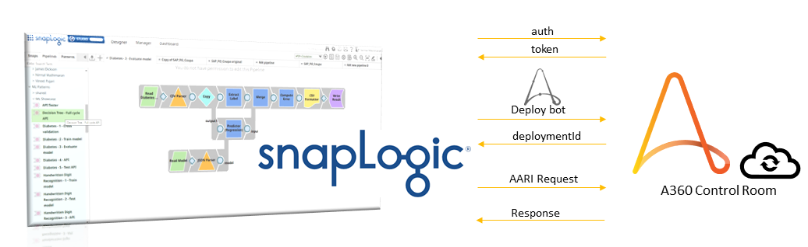

# SnapLogic Integration

You integrate SnapLogic with the Control Room and deploy bots. Authenticate yourself to access a Control Room and then deploy or perform other operations by using various Control Room APIs.

SnapLogic is a data integration platform that can connect to any source, and deliver data in a suitable format for analytical solutions. SnapLogic has many pre-built connectors called *snaps*. Snaps are the building blocks of a pipeline that perform a single function such as reading, writing, or acting on data. A *pipeline* is a collection of snaps that orchestrate data flow between endpoints. You can use these snaps to integrate data from applications to derive insights. You can easily integrate Automation 360 to a variety of applications using the SnapLogic Intelligent Integration Platform \(IIP\). SnapLogic is an industry leading iPaaS \(Integration Platform-as-a-service\) vendor with single platform used to integrate applications, data, and things seamlessly.

# Calling  bots from SnapLogic

In order to deploy a bot, you first authenticate and get a valid token. With a valid token, you can deploy a bot in Automation 360 from SnapLogic.

Make sure you have a valid SnapLogic account. If you do not already have a SnapLogic account, you can register for a [30-day free trial](https://www.snaplogic.com/free-trial-agilisium).

To deploy a bot from SnapLogic, perform the following steps:

1.  Log in to your SnapLogic account with the provided credentials, and then select the **Manager** section.

2.  You can create or modify an existing Pipeline. You obtain the inputs from the Pipeline and use them to feed the Automation 360 bot that you are planning to deploy. For more details, see [Working with Pipelines](https://docs-snaplogic.atlassian.net/wiki/spaces/SD/pages/1439001/Working+with+Pipelines).

2.  You can create or modify an existing Pipeline. You will derive the inputs from the Pipeline to feed your  bot that you are planning to deploy. For more information on Working with Pipelines, see [Working with Pipelines](https://docs-snaplogic.atlassian.net/wiki/spaces/SD/pages/1439001/Working+with+Pipelines).

3.  Search for the REST snap, and Mapper. Then, attach them as shown in the image where you can drag and attach the snaps together in the canvas.
Download the [sample snaps](sample/NM-pipeline-0_2022_11_15.zip) and update it with your Control Room URL, credentials, and other required parameters. You can use it while building your pipeline.

4.  Double-click the **REST Post** snap and enter details to get authenticated to access the Automation 360 Control Room:

    *  Enter a Label in the **Label** field.

    *  Enter the Control Room URL with the authentication API in the **Service URL** field.

    *  Enter the body with the username and password in the **HTTP Entity field**.

5.  Double-click the Mapper snap and enter the details to capture the token from the authentication. Use the mapping table to extract the token and then map it to a variable. For example: `$response.entity.token` is mapped to `$token`.

    

6.  Double-click the REST Post snap and enter the details to deploy a bot:

    *  Enter a Label in the **Label** field.

    *  Enter the Control Room URL in the **Service URL** field.

    *  Enter the body with the username and password in the **HTTP Entity field**.

    *  Pass the token saved in the Mapper snap to the **HTTP header**.
